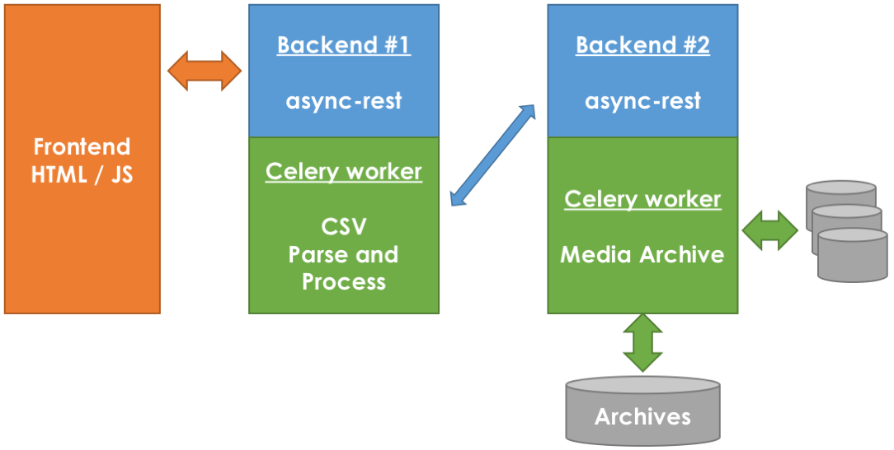

.. title:: A RESTful way of dealing with asynchronous tasks in Django

:css: css/style.css
:skip-help: true

**********
async-rest
**********

A RESTful way of dealing with asynchronous tasks
================================================

Meetup Paris.py #11 - Drivy - 2016-09-27
----------------------------------------

@pa_schembri (http://netsach.com)
---------------------------------

----

********
Sommaire
********

- REST, resources et actions
- Starbucks Paradigm
- Présentation et intégration
- Exemple concret & retours d'expérience

----

**************************
REST : Resources & Actions
**************************

----

**************************
REST : Resources & Actions
**************************

API Endpoint : ``https://my.todoapp.com/todo/[<id>/]``

Actions disponibles :

- POST -> Create
- GET -> Read
- PUT -> Update
- DELETE -> Destroy

.. note::

    - Exemple de la todo app et de la gestion des actions sur les tâches
    - Simple et pratique pour les ressources "simples"

----

***************************
Durée de traitements > O(s)
***************************

- Traitements en batch
- Calculs sur base de données *Big Data*
- Intéraction avec des équipements hardware
- ...

----

************
Solutions...
************

- HTTP Long polling
- [Web]sockets
- Callbacks, asyncio, async & await
- ...

... non satisfaisantes
======================

----

***********
Task queues
***********

- Celery
- RQ
- other task queue managers

REST ? :

- ``celery.task.http`` : webhooks ?
- ?

----

********
REST !!!
********

----

******************
Starbucks Paradigm
******************

----

******************
Starbucks Paradigm
******************

ou comment appliquer REST dans le monde réel...

1. Commande d'un café (order)
2. Attente...
3. Où en est-on ? (polling)
4. Livraison du café (callback / polling)

`Référence : "REST In practice (978-0596805821)" <https://www.amazon.com/REST-Practice-Hypermedia-Systems-Architecture/dp/0596805829>`_

----

************************************
Proposition d'un workflow REST (1/2)
************************************

1. Commande d'une pizza : ``POST /regina/order``
2. ``POST => 302 => location: /orders/be7aa21c/``
3. Attente... la pizza est au four...
4. Où en est-on ? ... livreur en route...

----

************************************
Proposition d'un workflow REST (2/2)
************************************

.. code:: text

    #1 GET /orders/be7aa21c/
    HTTP/1.1 202 ACCEPTED
    Order : regina
            status : queued

    #2 GET /orders/be7aa21c/
    HTTP/1.1 201 CREATED
    Order : regina
            resource-url : /regina/ca4a5619/
            status : completed

----

**********
async-rest
**********

----

En bref
=======

- App Django
- Compatible Celery, RQ, et ``.apply_async(...)``
- django-async-rest
- Basée sur django-rest-framework

.. note::

    On rassemble ces mécanismes, on les applique au traitements de taches asynchrones et on intègre tout ça dans une librairie dédiée.

    abstraction de la gestion des tâches asynchrones

----

Intégration
===========

.. code:: python

    @app.task
    def cook_pizza(order):
        ...

    from async_rest.dispatcher import register
    ...
    register('regina', cook_pizza))
    register('margherita', cook_pizza))
    ...

.. note::

    L'intégration consiste à lier des resources à des tâches : ressources qui sont issues d'une tâche asynchrone.

----

Génération des endpoints
========================

Création automatique des endpoints :

.. code:: text

    /async/regina/order/ [POST only]
    /async/<resource-name>/order/ [POST only]
    /async/orders/<uuid>/ [GET only]
    /async/<resources>/<uuid>/ [GET only]

Accessible via JS / Client HTTP (Curl) / ...

----

Helpers
=======

``async_rest.helpers.fail_on_error``

.. code:: python

    with fail_on_error(order, 'No more pizza'):
        pizza_kind = order.resource_name
        ingredients = retrieve_ingredients(pizza_kind)
        ...

.. note::

    helper que l'on peut intégrer dans les tâches afin de gérer automatiquement les état (succès / échec)

----

Helpers
=======

.. code:: python

    # async_rest.helpers.ProgressItems

    with ProgressItems(order, csvreader, length) as rows:
        for row in rows:
            process_invoice(row)
            ...

    order.progress : 10%
    order.progress : 20%
    ...
    order.progress : 100%

.. note::

    helper que l'on peut intégrer dans les tâches afin de gérer automatiquement la progression de la commande

----

API Interne
===========

.. code:: python

    # async_rest.models.Order

    order = Order(resource_name, context)
    order.queue()
    ...
    order.fail()
    ...
    order.resource-url = reverse('ns:pizza', (pizza.pk,))
    order.save()
    ...

.. note::

    API simple
    resource_name
    context : contexte d'exécution de la tâche

----

**************************************
Exemple concret & retours d'expérience
**************************************

----

.. note::

    Projet : client média

    Frontend en javascript
    2 backends

    - Premier dédié à l'interface utilisateur
    - Deuxième backend : Traitement machine (archivage media)

    Workflow :
    1. un utilisateur pousse un fichier CSV avec des identifiers de médias et des chemins d'accès
    2. Le fichier est traité relativement rapidement (vérification de base)
    3. Le process d'archivage - très long (plusieurs heures) est réalisé sur une autre infrastructure distante
    4. Ici, double utilisation de async rest : Javascript et Client REST Python

----

********************
Retours d'expérience
********************

- Mécanisme initial pas 100% REST
- Tentation du RPC / SOAP
- Effort particulier dans la terminologie (action / resource)
- Dépendance à Django / DRF / Celery

----

*******
Roadmap
*******

- Passage sous licence libre
- Découplage Django / DRF
- Ajout du mécanisme de callback
- Ajout d'autres helpers (``post_on_completion``, ...)
- contact : pa.schembri@netsach.com

----

*****
Q & A
*****

.. code:: text

    GET /end-of-talk/
    HTTP/1.1 406 Not Acceptable

- We're hiring !
- website : http://netsach.com
- contact : pa.schembri@netsach.com